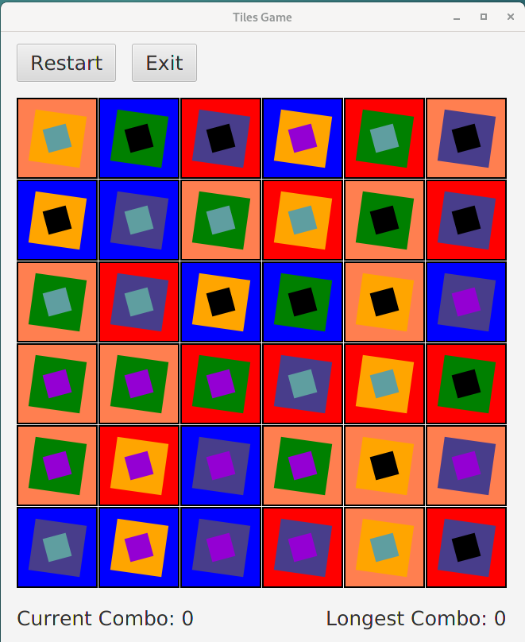

# Tiles

This game is based on [NY Times Tiles Game](https://www.nytimes.com/puzzles/tiles).

### How to play

* Select two tiles to remove all shared elements, increasing the combo score by one.
* The tiles do not have to be adjacent.
* Elements must be the same shape, color, and position to be removed.
* The second tile you select will become your new first tile.  Try to continue this combo until the whole board is cleared.
* If you end your move on an empty tile, you can start again from any tile without losing your combo.

### Features

* Each tile has at least three different elements.
* Tiles are randomly initialized with every time the game is played.
* The board has 36 tiles.
* Currently selected item is indicated via change in stroke color.

### Additional Info

* For best UX, please play game with default windows size.
* Right now there is no implementation for matching two or more tiles yet.

### Screenshot

